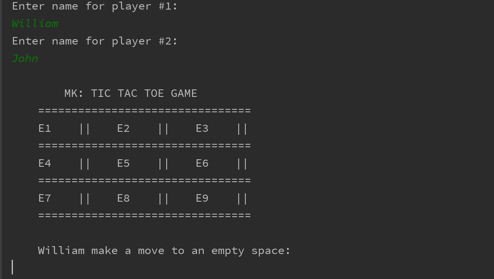
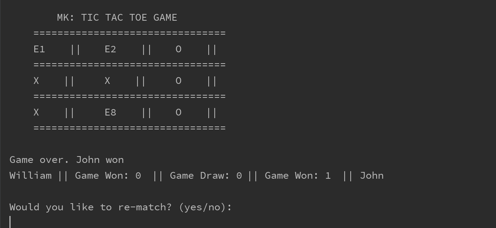
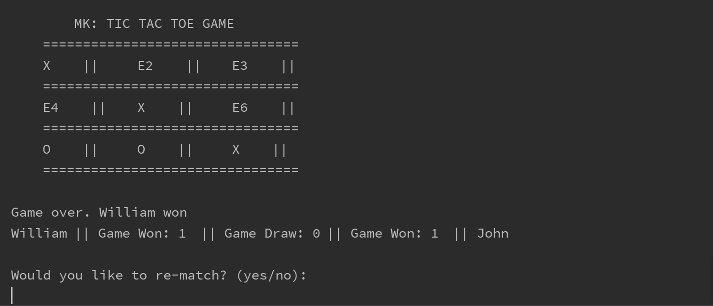

# MK: Tic Tac Toe

MK Tic Tac Toe is a simple java game design for two player. 
The game ask both player to enter their name and after 
that, it will draw the dashboard for the players. And ask 
the first player to make a move etc. The game also will print
the score record for the player if there is a win or tie and it 
will ask the players if they want to re-match or not.

#### Below are some screen shots of the game
This is a screen shot of the **dashboard**.

This is a screen shot of the player record after 
there was a winner

This is also another screen shot of the player record 
after there was a winner
